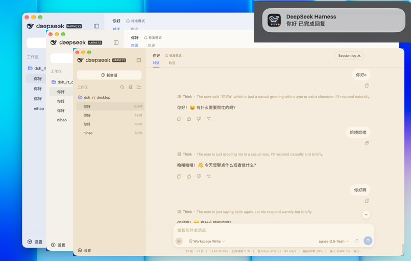

# iyam-dsh-desktop

DeepSeek Harness（DSH）的跨平台原生桌面客户端。首次启动时会**自动下载并部署** Node.js 运行时与 DSH 内核到本地 `~/.dsh`，之后开箱即用，**无需用户手动安装 Node.js**。



## 功能特性

- **开箱即用**：首次启动自动下载 Node 运行时与 DSH 内核到 `~/.dsh/`（经 npmmirror / npm 官方镜像回退，约 1~2 分钟），之后直接复用，秒级启动。
- **跨平台**：macOS（Intel / Apple Silicon）、Windows 10/11、主流 Linux 发行版。
- **完整 DSH 生态兼容**：`dsh plugin add/remove`、Agent Presets、Cordis 插件系统、内核升级等全部可用。
- **系统通知点击唤起**：对话完成后的系统通知，点击即可把应用窗口带到前台。

## 安装包下载

发布版安装包在 [Releases](https://github.com/iyam-x/iyam-dsh-desktop/releases) 页面，按操作系统选择：

| 平台 | 安装包 | 说明 |
| --- | --- | --- |
| macOS（Apple Silicon） | iyam-dsh_<版本>_aarch64.dmg | 拖入「应用程序」即可 |
| macOS（Intel） | iyam-dsh_<版本>_x64.dmg | 同上 |
| Windows 10/11（x64） | iyam-dsh_<版本>_x64-setup.exe | 双击安装 |
| Linux（x64） | iyam-dsh_<版本>_amd64.AppImage / iyam-dsh_<版本>_amd64.deb | AppImage chmod +x 后运行；deb 用 apt install |

### 系统要求

- macOS 10.15+ / Windows 10 1803+ / 主流 Linux 发行版
- 磁盘剩余空间 ≥ 1GB（Node 运行时 + DSH 内核部署到 `~/.dsh/` 后共约 600~800MB）
- **不需要** 预先安装 Node.js 或 npm
- **首次启动需联网**：用于下载 Node 运行时与 DSH 内核（尽力走 npmmirror 镜像，失败回退 npm 官方源）；之后日常使用不再依赖网络（除非主动检查更新）

### 首次启动

1. 双击应用，会显示「正在安装 DeepSeek Harness…」：自动下载 Node 运行时（镜像回退）→ 用托管 Node 的 npm 把 `@deepseek-ai/dsh` 装到 `~/.dsh/`（全局布局，约 1~2 分钟，**需联网**）。
2. 部署完成后自动启动 DSH 并加载 Web UI。
3. 后续启动直接复用 `~/.dsh/` 本地安装，秒级启动，不再下载。

### 常见问题

- **macOS 提示"无法验证开发者"**：当前为未签名/未公证版本。首次打开请右键点击图标 → 「打开」；正式发布后会提供签名公证版本。
- **Windows 提示 SmartScreen**：点击「更多信息」→「仍要运行」。
- **首次启动卡在"正在安装"**：检查网络是否可访问 npmmirror / npm 官方源；安装日志见 `~/.dsh/.iyam-dsh-stderr.log`。
- **卸载**：删除应用 + 删除 `~/.dsh/` 目录即可完全清除（含已下载的 Node 与 DSH）。

## 从源码构建（开发者）

### 前置依赖

- [Node.js](https://nodejs.org/) 20+
- [Rust](https://www.rust-lang.org/) 稳定版工具链
- [pnpm](https://pnpm.io/) 9
- 平台原生依赖：
  
  - **Linux**：`libwebkit2gtk-4.1-dev libappindicator3-dev librsvg2-dev patchelf libgtk-3-dev build-essential pkg-config libssl-dev python3`
  - **macOS**：Xcode Command Line Tools（`xcode-select --install`）
  - **Windows**：Visual Studio 2022 含「使用 C++ 的桌面开发」

### 步骤

```bash
pnpm install                 # 安装前端依赖
pnpm tauri:dev               # 开发模式（热重载）
pnpm tauri:build             # 生产构建（仅打包壳与内置插件，不含 DSH 内核/Node）
```

> 安装包**不再内置** DSH 内核与 Node 运行时；二者在用户首次启动时按需下载到 `~/.dsh/`（见「工作原理」）。如需本地预拉取运行时用于离线验证，可手动执行 `pnpm fetch:dsh`（拉取 DSH 到 bundle 资源目录，仅供调试，不影响正式分发）。

构建产物位于 `src-tauri/target/release/bundle/` 下对应平台的目录。

## 持续集成 / 自动构建

仓库已配置 GitHub Actions（`.github/workflows/build.yml`）：推送 `v*` 标签或手动触发 `workflow_dispatch` 时，会在 **macOS（aarch64 + x64）、Windows、Linux** 四个运行器上并行构建，并将各平台安装包作为 Assets 上传到一个**草稿 Release**（`releaseDraft: true`），供你检查后发布。

- 首次构建会下载 DSH 内核与 Node 运行时，单次构建耗时较长，属正常现象。
- 如需对 macOS 产物做签名/公证，在项目 Secrets 中填入 `APPLE_CERTIFICATE`、`APPLE_CERTIFICATE_PASSWORD`、`APPLE_SIGNING_IDENTITY`、`APPLE_ID`、`APPLE_PASSWORD`、`APPLE_TEAM_ID` 即可自动生效（留空则产出未签名包）。

## 工作原理

```
iyam-dsh-desktop (Tauri v2)
├── Rust 后端：进程管理、首次启动按需下载并部署 Node + DSH 到 ~/.dsh/
├── React 前端：状态 UI（Installing / Loading / Ready / Error / Crashed）
├── 运行时下载器（downloader.rs）：Node 镜像回退 + npm 全局安装 @deepseek-ai/dsh
├── 内置体验插件：dsh-shell-plugin / dsh-rtui-ui / dsh-file-handler（随壳分发）
└── 嵌入 DSH Web UI：WebView 直连 http://127.0.0.1:<port>
```

1. **首次启动下载**：检测 `~/.dsh/` 是否已安装 dsh（及托管 Node）。未安装时：
   - 经 npmmirror → npm 官方镜像下载 Node 24 归档并解压到 `~/.dsh/node/`；
   - 用托管 Node 的 npm 以全局布局（`-g --prefix ~/.dsh`）安装 `@deepseek-ai/dsh`，约 1~2 分钟。
2. **后续启动**：直接复用 `~/.dsh/` 本地安装，秒级启动，不再下载。
3. **进程管理**：用托管 node spawn `lib/bin.js web --port 0`，监听 stdout 获取端口，通过 Tauri Event 通知前端。
4. **UI 渲染**：前端收到端口后用 `<iframe src="http://127.0.0.1:<port>">` 加载 DSH Web UI。
5. **升级（备货机制）**：「检查更新」发现 registry 有新版本时，后台把新版本装到 `~/.dsh/.staging`，写 `.update.json`；下次启动提升（apply）到正式目录，失败自动回滚到上一可用版本。版本未变不会重新下载。

不读取系统 node、不读取系统全局安装的 dsh（除非用户在 PATH 上自行安装并经探测选用）。手动终端使用可通过 `~/.dsh/bin/dsh`（Windows 为 `dsh.cmd`）。

## 项目结构

```
iyam-dsh-desktop/
├── package.json                  # Tauri + Vite 项目配置
├── scripts/
│   └── fetch-dsh.mjs             # 调试用：本地预拉取 DSH 到 bundle 资源（不影响正式分发）
├── src/                          # React 前端
├── src-tauri/
│   ├── bin/dsh-{shell,rtui-ui,file-handler}/  # 内置体验插件（随壳分发）
│   ├── src/{main,installer,process,downloader,updater,notify}.rs
│   ├── tauri.conf.json           # 窗口、bundle、安全配置
│   ├── capabilities/             # 权限策略
│   └── build.rs                  # 将内置插件打包进 app Resources（不含 DSH/Node）
├── .github/workflows/build.yml   # 跨平台自动构建
└── PLAN.md                       # 完整方案文档
```

## 与 DSH 生态兼容

| 功能 | 行为 |
| --- | --- |
| dsh plugin add <pkg> / dsh plugin remove <pkg> | ✅ 完整可用 |
| Agent Presets | ✅ 读取 ~/.dsh/.agent-presets/ |
| Cordis 插件系统 | ✅ 完整保留 |
| DSH 内核升级 | 菜单「检查更新」后台备货，下次启动生效（失败自动回滚） |

## 风险提示

- **代码签名 / 公证**：macOS / Windows 发布前建议进行平台签名与公证，否则用户首次打开会有系统安全警告。
- **Windows WebView2**：确保用户系统已安装 WebView2 Runtime（Windows 10/11 默认已安装）。
- **首次启动需联网**：DSH 内核与 Node 运行时在首次启动时下载，请保证可访问 npmmirror / npm 官方源；安装包本身仅约 14MB（壳 + 前端 + 内置插件）。
- **托管 Node 升级**：Node 版本由 `src-tauri/src/downloader.rs` 的 `NODE_VERSION` 常量控制，升级 Node 需重新发版；DSH 版本由应用内「检查更新」独立升级，无需重装应用。

## 许可证

本项目以 [MIT 许可证](./LICENSE) 开源。